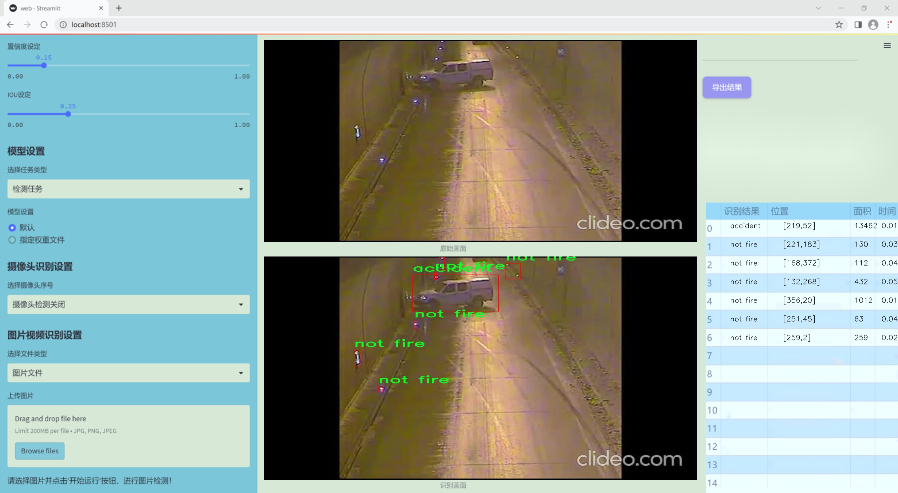
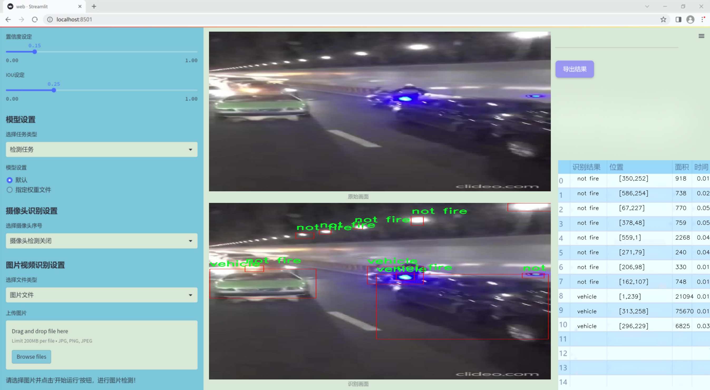
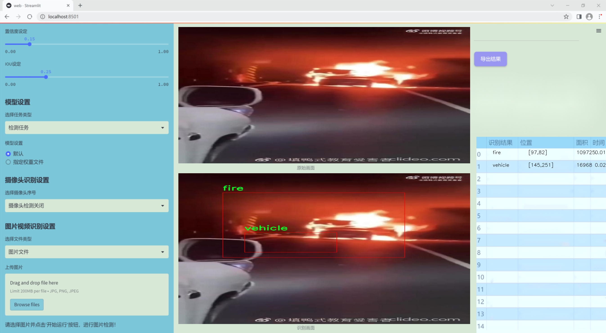
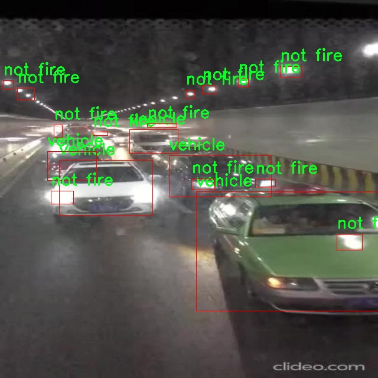
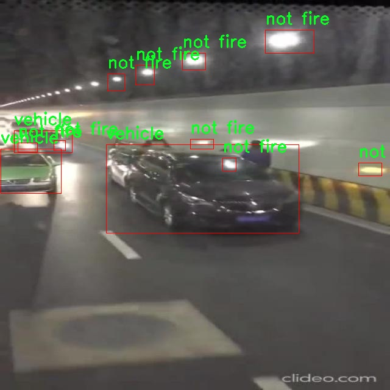
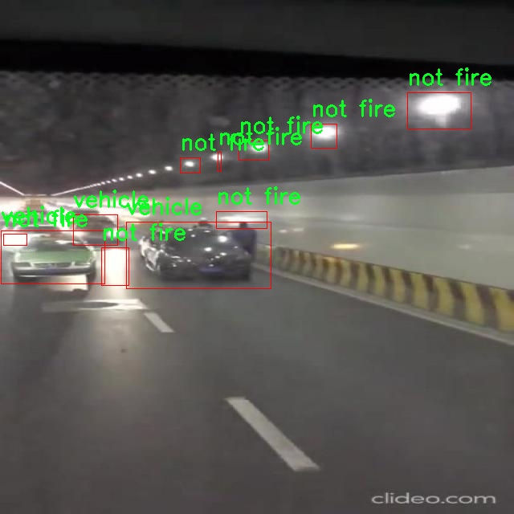
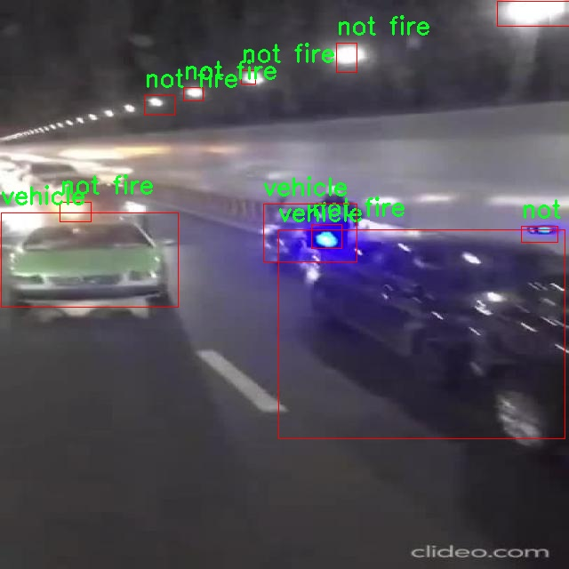

### 1.背景意义

研究背景与意义

随着城市化进程的加快，隧道作为重要的交通基础设施，承载着日益增长的交通流量。然而，隧道内的安全隐患也随之增加，尤其是车祸和火灾等突发事件，可能导致严重的人员伤亡和财产损失。因此，建立一个高效的隧道安全事件检测系统，能够及时识别和响应这些危险情况，显得尤为重要。

近年来，计算机视觉技术的快速发展为安全监测提供了新的解决方案。YOLO（You Only Look Once）系列算法因其高效的实时目标检测能力，已成为该领域的研究热点。特别是YOLOv11的改进版本，结合了更先进的深度学习技术，能够在复杂环境中实现更高的检测精度和速度。通过针对隧道特定场景的训练，YOLOv11可以有效识别事故、火灾、行人和车辆等多种类别，从而为隧道安全管理提供有力支持。

本研究基于一个包含156张图像的数据集，涵盖了五个类别：事故、火灾、非火灾、行人和车辆。这些类别的划分不仅有助于提高模型的识别能力，也为后续的事件响应提供了明确的指引。数据集中的图像经过预处理，确保了输入数据的一致性和可用性，为模型训练奠定了良好的基础。

通过改进YOLOv11算法，本项目旨在构建一个隧道安全事件检测系统，能够实时监测和识别潜在的安全威胁。这一系统的成功实施，将有助于提升隧道的安全管理水平，减少事故发生的概率，并为应急响应提供及时的信息支持，最终实现保障公众安全的目标。

### 2.视频效果

[2.1 视频效果](https://www.bilibili.com/video/BV1UmmyYvEhv/)

### 3.图片效果







##### [项目涉及的源码数据来源链接](https://kdocs.cn/l/cszuIiCKVNis)**

注意：本项目提供训练的数据集和训练教程,由于版本持续更新,暂不提供权重文件（best.pt）,请按照6.训练教程进行训练后实现上图演示的效果。

### 4.数据集信息

##### 4.1 本项目数据集类别数＆类别名

nc: 5
names: ['accident', 'fire', 'not fire', 'pedestrian', 'vehicle']


该项目为【目标检测】数据集，请在【训练教程和Web端加载模型教程（第三步）】这一步的时候按照【目标检测】部分的教程来训练

##### 4.2 本项目数据集信息介绍

本项目数据集信息介绍

本项目旨在改进YOLOv11模型，以实现隧道安全事件的高效检测，特别关注车祸和火灾等紧急情况。为此，我们构建了一个专门的数据集，涵盖了隧道环境中可能发生的多种安全事件。该数据集的主题围绕“隧道”展开，包含了五个主要类别，分别是“事故”、“火灾”、“非火灾”、“行人”和“车辆”。这些类别的选择旨在全面覆盖隧道内可能出现的各种安全隐患，确保模型能够在实际应用中准确识别和响应。

在数据集的构建过程中，我们收集了大量的图像和视频数据，确保其在多种光照和天气条件下的多样性，以增强模型的鲁棒性。每个类别的样本数量经过精心设计，以确保训练过程中的平衡性，避免模型对某一类别的偏向。事故类别主要包括各种类型的交通事故场景，火灾类别则专注于火焰和烟雾的表现，非火灾类别则提供了正常的隧道环境图像，以帮助模型学习区分正常与异常情况。行人和车辆类别则进一步丰富了数据集，使得模型能够识别隧道内的动态元素，从而提高其对突发事件的响应能力。

此外，数据集还包含了多种标注信息，以便于后续的训练和验证过程。通过使用高质量的标注数据，我们期望模型能够在隧道安全事件的检测中实现更高的准确率和更快的响应时间。总之，本项目的数据集不仅为改进YOLOv11提供了坚实的基础，也为未来的隧道安全监测系统的研究和应用奠定了重要的理论和实践依据。










### 5.全套项目环境部署视频教程（零基础手把手教学）

[5.1 所需软件PyCharm和Anaconda安装教程（第一步）](https://www.bilibili.com/video/BV1BoC1YCEKi/?spm_id_from=333.999.0.0&vd_source=bc9aec86d164b67a7004b996143742dc)


[5.2 安装Python虚拟环境创建和依赖库安装视频教程（第二步）](https://www.bilibili.com/video/BV1ZoC1YCEBw?spm_id_from=333.788.videopod.sections&vd_source=bc9aec86d164b67a7004b996143742dc)

### 6.改进YOLOv11训练教程和Web_UI前端加载模型教程（零基础手把手教学）

[6.1 改进YOLOv11训练教程和Web_UI前端加载模型教程（第三步）](https://www.bilibili.com/video/BV1BoC1YCEhR?spm_id_from=333.788.videopod.sections&vd_source=bc9aec86d164b67a7004b996143742dc)


按照上面的训练视频教程链接加载项目提供的数据集，运行train.py即可开始训练



     Epoch   gpu_mem       box       obj       cls    labels  img_size
     1/200     20.8G   0.01576   0.01955  0.007536        22      1280: 100%|██████████| 849/849 [14:42<00:00,  1.04s/it]
               Class     Images     Labels          P          R     mAP@.5 mAP@.5:.95: 100%|██████████| 213/213 [01:14<00:00,  2.87it/s]
                 all       3395      17314      0.994      0.957      0.0957      0.0843

     Epoch   gpu_mem       box       obj       cls    labels  img_size
     2/200     20.8G   0.01578   0.01923  0.007006        22      1280: 100%|██████████| 849/849 [14:44<00:00,  1.04s/it]
               Class     Images     Labels          P          R     mAP@.5 mAP@.5:.95: 100%|██████████| 213/213 [01:12<00:00,  2.95it/s]
                 all       3395      17314      0.996      0.956      0.0957      0.0845

     Epoch   gpu_mem       box       obj       cls    labels  img_size
     3/200     20.8G   0.01561    0.0191  0.006895        27      1280: 100%|██████████| 849/849 [10:56<00:00,  1.29it/s]
               Class     Images     Labels          P          R     mAP@.5 mAP@.5:.95: 100%|███████   | 187/213 [00:52<00:00,  4.04it/s]
                 all       3395      17314      0.996      0.957      0.0957      0.0845


###### [项目数据集下载链接](https://kdocs.cn/l/cszuIiCKVNis)

### 7.原始YOLOv11算法讲解


###### YOLOv11改进方向

与YOLOv 10相比，YOLOv 11有了巨大的改进，包括但不限于：

  * 增强的模型结构：模型具有改进的模型结构，以获取图像处理并形成预测
  * GPU优化：这是现代ML模型的反映，GPU训练ML模型在速度和准确性上都更好。
  * 速度：YOLOv 11模型现在经过增强和GPU优化以用于训练。通过优化，这些模型比它们的前版本快得多。在速度上达到了25%的延迟减少！
  * 更少的参数：更少的参数允许更快的模型，但v11的准确性不受影响
  * 更具适应性：更多支持的任务YOLOv 11支持多种类型的任务、多种类型的对象和多种类型的图像。

###### YOLOv11功能介绍

Glenn Jocher和他的团队制作了一个令人敬畏的YOLOv 11迭代，并且在图像人工智能的各个方面都提供了YOLO。YOLOv 11有多种型号，包括：

  * 对象检测-在训练时检测图像中的对象
  * 图像分割-超越对象检测，分割出图像中的对象
  * 姿态检测-当用点和线训练时绘制一个人的姿势
  * 定向检测（OBB）：类似于对象检测，但包围盒可以旋转
  * 图像分类-在训练时对图像进行分类

使用Ultralytics Library，这些模型还可以进行优化，以：

  * 跟踪-可以跟踪对象的路径
  * 易于导出-库可以以不同的格式和目的导出
  * 多场景-您可以针对不同的对象和图像训练模型

此外，Ultralytics还推出了YOLOv 11的企业模型，该模型将于10月31日发布。这将与开源的YOLOv
11模型并行，但将拥有更大的专有Ultralytics数据集。YOLOv 11是“建立在过去的成功”的其他版本的之上。

###### YOLOv11模型介绍

YOLOv 11附带了边界框模型（无后缀），实例分割（-seg），姿态估计（-pose），定向边界框（-obb）和分类（-cls）。

这些也有不同的尺寸：纳米（n），小（s），中（m），大（l），超大（x）。


YOLOv11模型

###### YOLOv11与前版本对比

与YOLOv10和YOLOv8相比，YOLOv11在Ultralytics的任何帖子中都没有直接提到。所以我会收集所有的数据来比较它们。感谢Ultralytics：

**检测：**


YOLOv11检测统计


YOLOv10检测统计

其中，Nano的mAPval在v11上为39.5，v10上为38.5；Small为47.0 vs 46.3，Medium为51.5 vs
51.1，Large为53.4 vs 53.2，Extra Large为54.7vs
54.4。现在，这可能看起来像是一种增量增加，但小小数的增加可能会对ML模型产生很大影响。总体而言，YOLOv11以0.3
mAPval的优势追平或击败YOLOv10。

现在，我们必须看看速度。在延迟方面，Nano在v11上为1.55 , v10上为1.84，Small为2.46 v2.49，Medium为4.70
v4.74，Large为6.16 v7.28，Extra Large为11.31
v10.70。延迟越低越好。YOLOv11提供了一个非常低的延迟相比，除了特大做得相当差的前身。

总的来说，Nano模型是令人振奋的，速度更快，性能相当。Extra Large在性能上有很好的提升，但它的延迟非常糟糕。

**分割：**


YOLOV11 分割统计


YOLOV9 分割统计


YOLOV8 分割数据

总体而言，YOLOv 11上的分割模型在大型和超大型模型方面比上一代YOLOv 8和YOLOv 9做得更好。

YOLOv 9 Segmentation没有提供任何关于延迟的统计数据。比较YOLOv 11延迟和YOLOv 8延迟，发现YOLOv 11比YOLOv
8快得多。YOLOv 11将大量GPU集成到他们的模型中，因此期望他们的模型甚至比CPU测试的基准更快！

姿态估计：


YOLOV11姿态估计统计


YOLOV8姿态估计统计

YOLOv 11的mAP 50 -95统计量也逐渐优于先前的YOLOv 8（除大型外）。然而，在速度方面，YOLOv
11姿势可以最大限度地减少延迟。其中一些延迟指标是版本的1/4！通过对这些模型进行GPU训练优化，我可以看到指标比显示的要好得多。

**定向边界框：**


YOLOv11 OBB统计


YOLOv8 OBB统计

OBB统计数据在mAP
50上并不是很好，只有非常小的改进，在某种程度上小于检测中的微小改进。然而，从v8到v11的速度减半，这表明YOLOv11在速度上做了很多努力。

**最后，分类：**


YOLOv 11 CLS统计


YOLOv8 CLS统计

从v8到v11，准确性也有了微小的提高。然而，速度大幅上升，CPU速度更快的型号。


### 8.200+种全套改进YOLOV11创新点原理讲解

#### 8.1 200+种全套改进YOLOV11创新点原理讲解大全

由于篇幅限制，每个创新点的具体原理讲解就不全部展开，具体见下列网址中的改进模块对应项目的技术原理博客网址【Blog】（创新点均为模块化搭建，原理适配YOLOv5~YOLOv11等各种版本）

[改进模块技术原理博客【Blog】网址链接](https://gitee.com/qunmasj/good)


#### 8.2 精选部分改进YOLOV11创新点原理讲解

###### 这里节选部分改进创新点展开原理讲解(完整的改进原理见上图和[改进模块技术原理博客链接](https://gitee.com/qunmasj/good)【如果此小节的图加载失败可以通过CSDN或者Github搜索该博客的标题访问原始博客，原始博客图片显示正常】

### RT-DETR骨干网络HGNetv2简介
#### RT-DETR横空出世
前几天被百度的RT-DETR刷屏，参考该博客提出的目标检测新范式对原始DETR的网络结构进行了调整和优化，以提高计算速度和减小模型大小。这包括使用更轻量级的基础网络和调整Transformer结构。并且，摒弃了nms处理的detr结构与传统的物体检测方法相比，不仅训练是端到端的，检测也能端到端，这意味着整个网络在训练过程中一起进行优化，推理过程不需要昂贵的后处理代价，这有助于提高模型的泛化能力和性能。


当然，人们对RT-DETR之所以产生浓厚的兴趣，我觉得大概率还是对YOLO系列审美疲劳了，就算是出到了YOLO10086，我还是只想用YOLOv11和YOLOv11的框架来魔改做业务。。

#### 初识HGNet
看到RT-DETR的性能指标，发现指标最好的两个模型backbone都是用的HGNetv2，毫无疑问，和当时的picodet一样，骨干都是使用百度自家的网络。初识HGNet的时候，当时是参加了第四届百度网盘图像处理大赛，文档图像方向识别专题赛道，简单来说，就是使用分类网络对一些文档截图或者图片进行方向角度分类。


当时的方案并没有那么快定型，通常是打榜过程发现哪个网络性能好就使用哪个网络做魔改，而且木有显卡，只能蹭Ai Studio的平台，不过v100一天8小时的实验时间有点短，这也注定了大模型用不了。 

流水的模型，铁打的炼丹人，最后发现HGNet-tiny各方面指标都很符合我们的预期，后面就一直围绕它魔改。当然，比赛打榜是目的，学习才是享受过程，当时看到效果还可以，便开始折腾起了HGNet的网络架构，我们可以看到，PP-HGNet 针对 GPU 设备，对目前 GPU 友好的网络做了分析和归纳，尽可能多的使用 3x3 标准卷积（计算密度最高），PP-HGNet是由多个HG-Block组成，细节如下：


ConvBNAct是啥？简单聊一聊，就是Conv+BN+Act，CV Man应该最熟悉不过了：
```python
class ConvBNAct(TheseusLayer):
    def __init__(self,
                 in_channels,
                 out_channels,
                 kernel_size,
                 stride,
                 groups=1,
                 use_act=True):
        super().__init__()
        self.use_act = use_act
        self.conv = Conv2D(
            in_channels,
            out_channels,
            kernel_size,
            stride,
            padding=(kernel_size - 1) // 2,
            groups=groups,
            bias_attr=False)
        self.bn = BatchNorm2D(
            out_channels,
            weight_attr=ParamAttr(regularizer=L2Decay(0.0)),
            bias_attr=ParamAttr(regularizer=L2Decay(0.0)))
        if self.use_act:
            self.act = ReLU()
 
    def forward(self, x):
        x = self.conv(x)
        x = self.bn(x)
        if self.use_act:
            x = self.act(x)
        return x 
```
且标准卷积的数量随层数深度增加而增多，从而得到一个有利于 GPU 推理的骨干网络，同样速度下，精度也超越其他 CNN ，性价比也优于ViT-base模型。


另外，我们可以看到：

PP-HGNet 的第一层由channel为96的Stem模块构成，目的是为了减少参数量和计算量。PP-HGNet

Tiny的整体结构由四个HG Stage构成，而每个HG Stage主要由包含大量标准卷积的HG Block构成。

PP-HGNet的第三到第五层使用了使用了可学习的下采样层（LDS Layer），该层group为输入通道数，可达到降参降计算量的作用，且Tiny模型仅包含三个LDS Layer，并不会对GPU的利用率造成较大影响.

PP-HGNet的激活函数为Relu，常数级操作可保证该模型在硬件上的推理速度。

### 9.系统功能展示

图9.1.系统支持检测结果表格显示

  图9.2.系统支持置信度和IOU阈值手动调节

  图9.3.系统支持自定义加载权重文件best.pt(需要你通过步骤5中训练获得)

  图9.4.系统支持摄像头实时识别

  图9.5.系统支持图片识别

  图9.6.系统支持视频识别

  图9.7.系统支持识别结果文件自动保存

  图9.8.系统支持Excel导出检测结果数据


### 10. YOLOv11核心改进源码讲解

#### 10.1 SwinTransformer.py

以下是对Swin Transformer模型的核心代码进行了简化和详细注释的版本。保留了主要的结构和功能，同时去掉了一些不必要的部分。

```python
import torch
import torch.nn as nn
import torch.nn.functional as F
from timm.models.layers import DropPath, to_2tuple, trunc_normal_

class Mlp(nn.Module):
    """多层感知机（MLP）模块"""
    def __init__(self, in_features, hidden_features=None, out_features=None, act_layer=nn.GELU, drop=0.):
        super().__init__()
        out_features = out_features or in_features  # 输出特征数
        hidden_features = hidden_features or in_features  # 隐藏层特征数
        self.fc1 = nn.Linear(in_features, hidden_features)  # 第一层线性变换
        self.act = act_layer()  # 激活函数
        self.fc2 = nn.Linear(hidden_features, out_features)  # 第二层线性变换
        self.drop = nn.Dropout(drop)  # Dropout层

    def forward(self, x):
        """前向传播"""
        x = self.fc1(x)  # 线性变换
        x = self.act(x)  # 激活
        x = self.drop(x)  # Dropout
        x = self.fc2(x)  # 线性变换
        x = self.drop(x)  # Dropout
        return x

def window_partition(x, window_size):
    """将输入张量分割成窗口"""
    B, H, W, C = x.shape  # 获取输入的维度
    x = x.view(B, H // window_size, window_size, W // window_size, window_size, C)  # 重塑张量
    windows = x.permute(0, 1, 3, 2, 4, 5).contiguous().view(-1, window_size, window_size, C)  # 窗口排列
    return windows

def window_reverse(windows, window_size, H, W):
    """将窗口合并回原始张量"""
    B = int(windows.shape[0] / (H * W / window_size / window_size))  # 计算批次大小
    x = windows.view(B, H // window_size, W // window_size, window_size, window_size, -1)  # 重塑张量
    x = x.permute(0, 1, 3, 2, 4, 5).contiguous().view(B, H, W, -1)  # 窗口反转
    return x

class WindowAttention(nn.Module):
    """窗口注意力机制模块"""
    def __init__(self, dim, window_size, num_heads):
        super().__init__()
        self.dim = dim
        self.window_size = window_size  # 窗口大小
        self.num_heads = num_heads  # 注意力头数
        head_dim = dim // num_heads  # 每个头的维度
        self.scale = head_dim ** -0.5  # 缩放因子

        # 定义相对位置偏置参数
        self.relative_position_bias_table = nn.Parameter(
            torch.zeros((2 * window_size[0] - 1) * (2 * window_size[1] - 1), num_heads))

        # 计算相对位置索引
        coords_h = torch.arange(self.window_size[0])
        coords_w = torch.arange(self.window_size[1])
        coords = torch.stack(torch.meshgrid([coords_h, coords_w]))  # 生成网格坐标
        coords_flatten = torch.flatten(coords, 1)  # 展平坐标
        relative_coords = coords_flatten[:, :, None] - coords_flatten[:, None, :]  # 计算相对坐标
        relative_coords = relative_coords.permute(1, 2, 0).contiguous()  # 重新排列
        relative_coords[:, :, 0] += self.window_size[0] - 1  # 偏移
        relative_coords[:, :, 1] += self.window_size[1] - 1
        relative_coords[:, :, 0] *= 2 * self.window_size[1] - 1
        self.relative_position_index = relative_coords.sum(-1)  # 计算相对位置索引

        self.qkv = nn.Linear(dim, dim * 3)  # 线性变换生成Q、K、V
        self.attn_drop = nn.Dropout(0.)  # 注意力Dropout
        self.proj = nn.Linear(dim, dim)  # 输出线性变换
        self.softmax = nn.Softmax(dim=-1)  # Softmax层

    def forward(self, x, mask=None):
        """前向传播"""
        B_, N, C = x.shape  # 获取输入维度
        qkv = self.qkv(x).reshape(B_, N, 3, self.num_heads, C // self.num_heads).permute(2, 0, 3, 1, 4)  # 计算Q、K、V
        q, k, v = qkv[0], qkv[1], qkv[2]  # 分离Q、K、V

        q = q * self.scale  # 缩放Q
        attn = (q @ k.transpose(-2, -1))  # 计算注意力

        # 添加相对位置偏置
        relative_position_bias = self.relative_position_bias_table[self.relative_position_index.view(-1)].view(
            self.window_size[0] * self.window_size[1], self.window_size[0] * self.window_size[1], -1)
        relative_position_bias = relative_position_bias.permute(2, 0, 1).contiguous()  # 重新排列
        attn = attn + relative_position_bias.unsqueeze(0)  # 加入偏置

        attn = self.softmax(attn)  # 计算Softmax
        attn = self.attn_drop(attn)  # 应用Dropout

        x = (attn @ v).transpose(1, 2).reshape(B_, N, C)  # 计算输出
        x = self.proj(x)  # 线性变换
        return x

class SwinTransformerBlock(nn.Module):
    """Swin Transformer块"""
    def __init__(self, dim, num_heads, window_size=7, shift_size=0, mlp_ratio=4.):
        super().__init__()
        self.dim = dim
        self.num_heads = num_heads
        self.window_size = window_size
        self.shift_size = shift_size
        self.norm1 = nn.LayerNorm(dim)  # 归一化层
        self.attn = WindowAttention(dim, window_size=to_2tuple(self.window_size), num_heads=num_heads)  # 窗口注意力
        self.norm2 = nn.LayerNorm(dim)  # 归一化层
        mlp_hidden_dim = int(dim * mlp_ratio)  # MLP隐藏层维度
        self.mlp = Mlp(in_features=dim, hidden_features=mlp_hidden_dim)  # MLP模块

    def forward(self, x):
        """前向传播"""
        shortcut = x  # 残差连接
        x = self.norm1(x)  # 归一化
        x_windows = window_partition(x.view(-1, self.window_size, self.window_size, self.dim), self.window_size)  # 分割窗口
        attn_windows = self.attn(x_windows)  # 计算注意力
        x = window_reverse(attn_windows, self.window_size, *x.shape[1:])  # 合并窗口
        x = shortcut + x  # 残差连接
        x = x + self.mlp(self.norm2(x))  # MLP处理
        return x

class SwinTransformer(nn.Module):
    """Swin Transformer主类"""
    def __init__(self, depths=[2, 2, 6, 2], num_heads=[3, 6, 12, 24], embed_dim=96):
        super().__init__()
        self.layers = nn.ModuleList()  # 存储各层
        for i in range(len(depths)):
            layer = SwinTransformerBlock(
                dim=embed_dim * (2 ** i),
                num_heads=num_heads[i],
                window_size=7)
            self.layers.append(layer)  # 添加层

    def forward(self, x):
        """前向传播"""
        for layer in self.layers:
            x = layer(x)  # 逐层处理
        return x

def SwinTransformer_Tiny(weights=''):
    """构建Swin Transformer Tiny模型"""
    model = SwinTransformer(depths=[2, 2, 6, 2], num_heads=[3, 6, 12, 24])
    if weights:
        model.load_state_dict(torch.load(weights)['model'])  # 加载权重
    return model
```

### 代码核心部分说明：
1. **Mlp类**：实现了一个简单的多层感知机，包括两层线性变换和激活函数。
2. **window_partition和window_reverse**：用于将输入张量分割成窗口以及将窗口合并回原始张量。
3. **WindowAttention类**：实现了窗口注意力机制，支持相对位置偏置。
4. **SwinTransformerBlock类**：实现了Swin Transformer的基本块，包含注意力机制和MLP。
5. **SwinTransformer类**：主模型类，构建了多个Swin Transformer块并实现了前向传播。
6. **SwinTransformer_Tiny函数**：用于构建一个小型的Swin Transformer模型，并可选择加载预训练权重。

通过这些核心部分，Swin Transformer能够有效地处理图像数据并提取特征。

这个文件实现了Swin Transformer模型的结构，Swin Transformer是一种基于视觉的Transformer架构，具有层次化的特性，适用于图像分类、目标检测等任务。代码主要由多个类组成，每个类实现了模型的不同部分。

首先，`Mlp`类定义了一个多层感知机（MLP），包含两个线性层和一个激活函数（默认为GELU），并在每个线性层后应用Dropout以防止过拟合。该类的`forward`方法实现了输入数据的前向传播。

接下来，`window_partition`和`window_reverse`函数用于将输入张量分割成窗口和将窗口合并回原始形状。这种分割和合并是Swin Transformer中窗口注意力机制的核心部分。

`WindowAttention`类实现了基于窗口的多头自注意力机制。它支持相对位置偏置，并在计算注意力时考虑了窗口内的相对位置。该类的`forward`方法接收输入特征和可选的掩码，并计算注意力输出。

`SwinTransformerBlock`类是Swin Transformer的基本构建块，包含一个窗口注意力层和一个MLP层。它还实现了短路连接和层归一化。`forward`方法处理输入特征，执行注意力计算，并通过MLP层进行处理。

`PatchMerging`类用于将特征图的不同区域合并为更小的区域，以降低特征图的分辨率并增加通道数。它在`forward`方法中实现了特征的合并和归一化。

`BasicLayer`类表示Swin Transformer的一个基本层，由多个Swin Transformer块组成，并在必要时执行下采样。它的`forward`方法计算输入特征的注意力掩码，并通过每个块进行前向传播。

`PatchEmbed`类负责将输入图像分割成小块，并将这些小块嵌入到高维空间中。它使用卷积层来实现这一点，并在必要时应用归一化。

`SwinTransformer`类是整个模型的主体，负责将所有组件组合在一起。它定义了模型的结构，包括各个层的深度、头数、窗口大小等超参数。在`forward`方法中，输入图像经过嵌入、层处理和归一化，最终输出特征。

最后，`update_weight`函数用于更新模型的权重，确保加载的权重与模型的结构匹配。`SwinTransformer_Tiny`函数则是一个工厂函数，用于创建一个小型的Swin Transformer模型，并可选择加载预训练权重。

总体来说，这个文件实现了Swin Transformer的完整结构，提供了灵活的配置选项，以适应不同的应用场景。

#### 10.2 ui.py

以下是代码中最核心的部分，并附上详细的中文注释：

```python
import sys
import subprocess

def run_script(script_path):
    """
    使用当前 Python 环境运行指定的脚本。

    Args:
        script_path (str): 要运行的脚本路径

    Returns:
        None
    """
    # 获取当前 Python 解释器的路径
    python_path = sys.executable

    # 构建运行命令，使用 streamlit 运行指定的脚本
    command = f'"{python_path}" -m streamlit run "{script_path}"'

    # 执行命令
    result = subprocess.run(command, shell=True)
    # 检查命令执行的返回码，如果不为0，表示执行出错
    if result.returncode != 0:
        print("脚本运行出错。")

# 实例化并运行应用
if __name__ == "__main__":
    # 指定要运行的脚本路径
    script_path = "web.py"  # 这里可以替换为实际的脚本路径

    # 调用函数运行脚本
    run_script(script_path)
```

### 代码说明：
1. **导入模块**：
   - `sys`：用于访问与 Python 解释器紧密相关的变量和函数。
   - `subprocess`：用于生成新的进程、连接到它们的输入/输出/错误管道，并获得它们的返回码。

2. **`run_script` 函数**：
   - 该函数接受一个参数 `script_path`，表示要运行的 Python 脚本的路径。
   - 使用 `sys.executable` 获取当前 Python 解释器的路径，以确保使用正确的 Python 环境。
   - 构建一个命令字符串，使用 `streamlit` 模块运行指定的脚本。
   - 使用 `subprocess.run` 执行命令，并检查返回码以确定脚本是否成功运行。

3. **主程序入口**：
   - 使用 `if __name__ == "__main__":` 确保只有在直接运行该脚本时才会执行以下代码。
   - 指定要运行的脚本路径（这里是 `web.py`）。
   - 调用 `run_script` 函数来执行指定的脚本。


#### 10.2 FreqFusion.py

以下是代码中最核心的部分，经过简化并添加了详细的中文注释：

```python
import torch
import torch.nn as nn
import torch.nn.functional as F

class FreqFusion(nn.Module):
    def __init__(self, channels, scale_factor=1, lowpass_kernel=5, highpass_kernel=3, **kwargs):
        super().__init__()
        hr_channels, lr_channels = channels
        self.scale_factor = scale_factor
        self.lowpass_kernel = lowpass_kernel
        self.highpass_kernel = highpass_kernel
        
        # 压缩高分辨率和低分辨率特征通道
        self.hr_channel_compressor = nn.Conv2d(hr_channels, (hr_channels + lr_channels) // 8, 1)
        self.lr_channel_compressor = nn.Conv2d(lr_channels, (hr_channels + lr_channels) // 8, 1)
        
        # 内容编码器，用于生成低通滤波器
        self.content_encoder = nn.Conv2d(
            (hr_channels + lr_channels) // 8,
            lowpass_kernel ** 2,
            kernel_size=3,
            padding=1
        )
        
        # 初始化权重
        self.init_weights()

    def init_weights(self):
        # 使用均匀分布初始化卷积层的权重
        for m in self.modules():
            if isinstance(m, nn.Conv2d):
                nn.init.xavier_uniform_(m.weight)
                if m.bias is not None:
                    nn.init.constant_(m.bias, 0)

    def forward(self, x):
        hr_feat, lr_feat = x  # 输入的高分辨率和低分辨率特征
        
        # 压缩特征
        compressed_hr_feat = self.hr_channel_compressor(hr_feat)
        compressed_lr_feat = self.lr_channel_compressor(lr_feat)
        
        # 生成低通滤波器
        mask_lr = self.content_encoder(compressed_lr_feat)
        
        # 进行上采样和融合
        lr_feat = F.interpolate(lr_feat, scale_factor=self.scale_factor, mode='nearest')
        lr_feat = lr_feat + mask_lr  # 将低通滤波器应用于低分辨率特征
        
        return lr_feat  # 返回融合后的特征

# 示例使用
# channels = (高分辨率通道数, 低分辨率通道数)
freq_fusion = FreqFusion(channels=(64, 32))
# 输入特征 hr_feat 和 lr_feat
output = freq_fusion((torch.randn(1, 64, 128, 128), torch.randn(1, 32, 64, 64)))
```

### 代码说明：
1. **导入必要的库**：使用 PyTorch 的核心库来构建神经网络。
2. **FreqFusion 类**：这是一个用于频率感知特征融合的神经网络模块。
   - `__init__` 方法：初始化网络结构，包括通道压缩和内容编码器。
   - `init_weights` 方法：初始化卷积层的权重，使用 Xavier 均匀分布。
   - `forward` 方法：定义前向传播过程，输入高分辨率和低分辨率特征，经过压缩和滤波后进行融合。
3. **示例使用**：创建 `FreqFusion` 的实例并传入随机生成的特征进行测试。

此代码段展示了如何构建一个简单的频率感知特征融合模块，核心在于对输入特征的压缩、滤波和融合过程。

这个程序文件 `FreqFusion.py` 实现了一种名为“频率感知特征融合”的深度学习模型，主要用于密集图像预测任务。该模型利用高频和低频特征的融合来提升图像重建的质量，特别是在超分辨率等应用中。

首先，文件导入了必要的库，包括 PyTorch 和一些图像处理相关的函数。它定义了一些初始化函数，例如 `normal_init` 和 `constant_init`，用于初始化神经网络中的卷积层权重和偏置。接着，定义了一个 `resize` 函数，用于调整输入张量的大小，并在调整过程中发出警告以确保对齐角的设置。

接下来，文件中定义了一个 `hamming2D` 函数，用于生成二维 Hamming 窗口，这在信号处理和图像处理中常用于减少边缘效应。

`FreqFusion` 类是模型的核心部分，继承自 `nn.Module`。在其构造函数中，模型接受多个参数，包括通道数、缩放因子、低通和高通卷积核的大小等。模型通过卷积层对高分辨率和低分辨率特征进行压缩，并生成低通和高通特征图。该类还包含用于初始化权重的 `init_weights` 方法。

在 `forward` 方法中，模型首先获取高分辨率和低分辨率特征，并通过压缩层处理这些特征。然后，模型根据设置的参数选择不同的路径来融合高频和低频特征。如果启用了半卷积（`semi_conv`），模型会使用 CARAFE（Content-Aware ReAssembly of FEatures）操作来进行特征重建。最终，模型将高频和低频特征相加，输出融合后的特征图。

此外，文件中还定义了一个 `LocalSimGuidedSampler` 类，用于生成偏移量以指导特征重采样。该类通过计算输入特征的相似度来生成偏移量，并在重采样过程中使用这些偏移量。它包含了多种参数设置，允许用户自定义重采样的方式。

最后，`compute_similarity` 函数用于计算输入张量中每个点与其周围点的余弦相似度，帮助评估特征之间的相似性。

总体而言，`FreqFusion.py` 文件实现了一个复杂的深度学习模型，旨在通过频率感知的方式有效融合不同分辨率的特征，以提高图像重建的质量。该模型适用于需要高精度图像预测的任务，如超分辨率重建和图像生成等。

#### 10.3 shiftwise_conv.py

以下是代码中最核心的部分，并附上详细的中文注释：

```python
import math
import torch
import torch.nn as nn
import torch.nn.functional as F

class Mask(nn.Module):
    def __init__(self, size):
        super().__init__()
        # 初始化一个可学习的参数weight，范围在-1到1之间
        self.weight = torch.nn.Parameter(data=torch.Tensor(*size), requires_grad=True)
        self.weight.data.uniform_(-1, 1)

    def forward(self, x):
        # 使用sigmoid函数将weight限制在0到1之间
        w = torch.sigmoid(self.weight)
        # 将输入x与权重w相乘，进行掩码操作
        masked_wt = w.mul(x)
        return masked_wt

class ReparamLargeKernelConv(nn.Module):
    def __init__(self, in_channels, out_channels, kernel_size, small_kernel=5, stride=1, groups=1, small_kernel_merged=False, Decom=True, bn=True):
        super(ReparamLargeKernelConv, self).__init__()
        self.kernel_size = kernel_size  # 大卷积核的大小
        self.small_kernel = small_kernel  # 小卷积核的大小
        self.Decom = Decom  # 是否使用分解方法
        padding = kernel_size // 2  # 计算填充大小，保持特征图大小不变

        # 如果小卷积核合并，则直接使用大卷积核
        if small_kernel_merged:
            self.lkb_reparam = nn.Conv2d(in_channels, out_channels, kernel_size, stride, padding, groups=groups, bias=True)
        else:
            # 如果使用分解方法，构建LoRA卷积
            if self.Decom:
                self.LoRA = conv_bn(in_channels, out_channels, kernel_size=(kernel_size, small_kernel), stride=stride, padding=padding, groups=groups, bn=bn)
            else:
                # 否则，使用原始的大卷积核
                self.lkb_origin = conv_bn(in_channels, out_channels, kernel_size, stride, padding, groups=groups, bn=bn)

            # 如果小卷积核小于大卷积核，则构建小卷积核
            if (small_kernel is not None) and small_kernel < kernel_size:
                self.small_conv = conv_bn(in_channels, out_channels, small_kernel, stride, small_kernel // 2, groups=groups, bn=bn)

        self.bn = nn.BatchNorm2d(out_channels)  # 批归一化层
        self.act = nn.SiLU()  # 激活函数

    def forward(self, inputs):
        # 前向传播
        if hasattr(self, "lkb_reparam"):
            out = self.lkb_reparam(inputs)  # 使用重参数化卷积
        elif self.Decom:
            out = self.LoRA(inputs)  # 使用LoRA卷积
            if hasattr(self, "small_conv"):
                out += self.small_conv(inputs)  # 加上小卷积的输出
        else:
            out = self.lkb_origin(inputs)  # 使用原始卷积
            if hasattr(self, "small_conv"):
                out += self.small_conv(inputs)  # 加上小卷积的输出
        return self.act(self.bn(out))  # 经过批归一化和激活函数后返回

    def get_equivalent_kernel_bias(self):
        # 获取等效的卷积核和偏置
        eq_k, eq_b = fuse_bn(self.lkb_origin.conv, self.lkb_origin.bn)
        if hasattr(self, "small_conv"):
            small_k, small_b = fuse_bn(self.small_conv.conv, self.small_conv.bn)
            eq_b += small_b  # 加上小卷积的偏置
            eq_k += nn.functional.pad(small_k, [(self.kernel_size - self.small_kernel) // 2] * 4)  # 在卷积核上进行填充
        return eq_k, eq_b

    def switch_to_deploy(self):
        # 切换到部署模式
        if hasattr(self, 'lkb_origin'):
            eq_k, eq_b = self.get_equivalent_kernel_bias()  # 获取等效卷积核和偏置
            self.lkb_reparam = nn.Conv2d(self.lkb_origin.conv.in_channels, self.lkb_origin.conv.out_channels, self.lkb_origin.conv.kernel_size, self.lkb_origin.conv.stride, self.lkb_origin.conv.padding, self.lkb_origin.conv.dilation, self.lkb_origin.conv.groups, bias=True)
            self.lkb_reparam.weight.data = eq_k  # 设置卷积核权重
            self.lkb_reparam.bias.data = eq_b  # 设置偏置
            self.__delattr__("lkb_origin")  # 删除原始卷积属性
            if hasattr(self, "small_conv"):
                self.__delattr__("small_conv")  # 删除小卷积属性
```

### 代码核心部分说明：
1. **Mask类**：用于生成一个可学习的掩码，通过sigmoid函数将权重限制在0到1之间，并与输入进行逐元素相乘，实现对输入的掩码操作。
  
2. **ReparamLargeKernelConv类**：实现了一个大卷积核的重参数化卷积层。根据输入参数决定是否使用分解方法（LoRA）或直接使用原始卷积。支持小卷积核的使用，能够在前向传播中灵活组合不同的卷积输出。

3. **前向传播**：根据模型的状态（是否使用重参数化、分解等）选择合适的卷积操作，并通过批归一化和激活函数处理输出。

4. **等效卷积核和偏置的获取**：通过融合批归一化层的参数，得到等效的卷积核和偏置，以便在部署时使用。

5. **切换到部署模式**：在模型部署时，将重参数化卷积的权重和偏置设置为等效值，并清理不再需要的属性。

这个程序文件 `shiftwise_conv.py` 定义了一个用于深度学习中卷积操作的模块，主要是实现了一种新的卷积方式，称为“重参数化大卷积”（ReparamLargeKernelConv）。该模块通过结合小卷积和大卷积的特性，旨在提高卷积操作的效率和灵活性。

首先，文件中导入了必要的库，包括 `torch` 和 `torch.nn`，这些是 PyTorch 深度学习框架的核心组件。接着，定义了一些辅助函数和类。`get_conv2d` 函数用于创建一个二维卷积层，支持多种参数配置，如输入输出通道数、卷积核大小、步幅、填充、扩张、分组和偏置。`get_bn` 函数则用于创建批归一化层。

`Mask` 类定义了一个可学习的掩码，掩码的权重在训练过程中会被优化。它的前向传播方法通过对输入进行 Sigmoid 激活后与输入相乘，生成一个加权的输出。

`conv_bn_ori` 函数用于构建一个包含卷积和可选批归一化的序列模块。`LoRAConvsByWeight` 类实现了一种特殊的卷积结构，它通过对小卷积和大卷积的输出进行加权组合，来实现更复杂的特征提取。该类的构造函数中定义了两个掩码和相关的批归一化层，前向传播方法则将输入分成多个部分进行处理，并通过掩码进行加权。

`conv_bn` 函数根据输入的卷积核大小决定使用普通卷积还是 LoRA 卷积。`fuse_bn` 函数用于将卷积层和批归一化层的参数融合，以便在推理阶段提高效率。

`ReparamLargeKernelConv` 类是整个文件的核心，它支持大卷积和小卷积的组合。构造函数中根据输入参数初始化相应的卷积层和批归一化层，并在前向传播中根据条件选择合适的卷积操作。该类还提供了获取等效卷积核和偏置的功能，以及切换到推理模式的方法。

整体而言，这个文件实现了一种灵活且高效的卷积结构，适用于深度学习模型中的特征提取任务，尤其是在需要处理不同尺度特征时，能够有效提升模型的性能。

### 11.完整训练+Web前端界面+200+种全套创新点源码、数据集获取


# [下载链接：https://mbd.pub/o/bread/Z5WamJlv](https://mbd.pub/o/bread/Z5WamJlv)